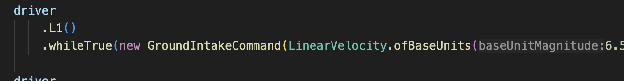
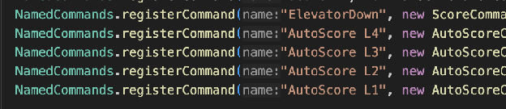
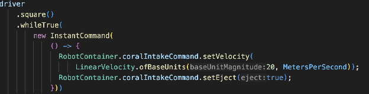

# Command Systems

Now that you have a command written, how do you put it into action? Every TeleOp command that is written needs to be called with a controller input, and every autonomous command needs to be registered with PathPlanner so it can be used in autonomous routines. 

## Commands in Code
After you write any command, it needs to have a place in code where it can be called. All of our TeleOp commands that can be used by the driver are called in ControlMap.java. To do this, our code imports WPILib’s controller command library, which just contains classes for Playstation and Xbox controllers as well as their buttons. To refer to any button on the controller, you can use the controller and call the method corresponding to its button (ex. For the square button on a Playstation controller named driver in the code, use driver.square()). From there, each button has four methods that take in commands to call them:

*whileTrue*: Calls a command continuously while a button is held down. The command is automatically ended when the button is no longer pressed.  
*onTrue*: Calls a command once when a button is pressed. Everything in the command is run once (including its execute method), and the command ends.  
*whileFalse*: Calls a command continuously when a button stops being pressed. The command ends when the button is pressed once again.  
*onFalse*: Calls a command once when a button stops being pressed. Everything in the command is run once, and the command ends.

Whichever method you use, you want to then pass in a command for it to call. You can even construct the command inside the method call. Commands can also be called with a timeout by calling .withTimeout on any command. This creates a timer that automatically ends the command once enough time has passed.  

For autonomous commands, the process is a little different because all commands will need to be used by themselves in PathPlanner. In this case, PathPlanner has a library of named commands which you can register your own commands to. These commands will then show up in PathPlanner when building an autonomous. All autonomous commands are registered in robotContainer and you can simply call NamedCommands’ method registerCommand to do so. It takes in a name (which will be displayed in PathPlanner) and a command to register.

## Default Commands and Instant Commands
In addition to calling commands in the way shown above, there are also a few extra ways to call commands which differ. These are default and instant commands. 

**A default command** can be called on any subsystem in the code and tells that subsystem to always run that command automatically. This can be done by using the setDefaultCommand method that is automatically included in each subsystem through SubsystemBase and passing in a command. When a default command is set, the subsystem will keep calling that command constantly. If the subsystem is given another command to call, the command overrides the default command. Once the overriding command ends, the default command resumes. **However, the command will be unable to override the default command if the default command has a required subsystem**. The code will not call the overriding command simply because it is told to prevent a subsystem from scheduling two commands at once. This means that if you do use the addRequirements method in a default command you will need to instead have a command whose values you change while running the code and which can do everything that is needed of the subsystem. 

For example, an intake default command can have a velocity instance variable which has a method that changes it. The default command will constantly run the intake at a given value and the button presses simply change the velocity variable. 

**An instant command** works in almost the exact opposite way because it acts as a lambda (which is a method that is defined in one line and mostly does one or two simple things). Instant commands are defined without a class associated with them and do something simple. They are only called once and then removed.

Calling an instant command must occur in the code for a button input and must always be done by calling the InstantCommand constructor. The constructor takes in a lambda expression, which can be done by putting two closed parentheses, then an arrow, then the simple command you want done in one line of code. If you want to do more than one line, you can include brackets and put lines of code in there.  
() → one line of code;  
() → {Line of code 1  
Line of code 2};
