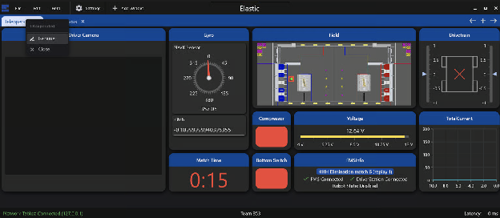
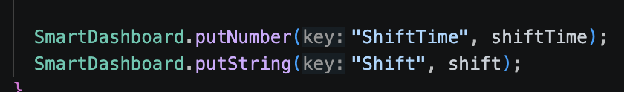
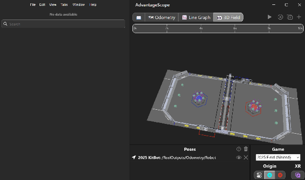

# Extra Tools

## Elastic
Elastic is a third-party tool that allows you to see real time robot data as well as change certain things about your robot on the fly. There isn’t much we can say about Elastic other than that. Because Elastic is a third party app, it cannot be opened within WPILib itself, but other than that it functions by connecting to the robot code. The average Elastic dashboard looks sort of like this.

*Photo taken from Elastic documentation, which you can also find [here](https://frc-elastic.gitbook.io/docs/getting-started/app-navigation)*

Each of the windows in the above photo are called “widgets,” and they are small windows corresponding to one thing about the robot that you want to know. In the screenshot, there are widgets for the robot’s pitch, its voltage, its position on the field, etc. In addition to some pre-built widgets, you can also create your own custom widgets! Elastic mostly uses the Tunables API, a built-in WPILib library, to create custom widgets. In general, a widget uses a “put” command (ex. putNumber) to create a widget. 

*This is an old photo – “SmartDashboard” should be replaced with “Tunables”*  
Once you create a widget, all you need to do is to click the “+” in the top right corner and select the widget. Then, place it according to your heart’s desires.

## Advantage Scope
Advantage Scope is an application that comes with AdvantageKit, and it allows us to view logged inputs from the robot in an organized place, as well as plot that data and manipulate it in a few ways for analysis. This also allows for data playback, showing us how values on the robot changed during matches. This is an incredibly important application, as sometimes things go wrong on the robot during the match in a way that we can’t easily replicate. Advantage Scope allows us to see those errors as they happened. To use Advantage Scope, you need to launch the standalone application. However, it comes hand in hand with AdvantageKit logging.  
  
From there, you need to load in a set of logged data (obtained from the computer or from a USB containing logged data), which is then displayed in the application. Additionally, you may also connect to the live robot as it is in real time to display its current status. Advantage Scope allows you to display logged data in different ways, such as with 2D graphs.

Importantly, Advantage Scope also has the ability to display where the robot believed it was positioned on the field at any given time. This can allow you to debug issues where the robot’s believed position was different from where it actually was, giving you the ability to clear up issues with functionalities such as vision.

Although this covers the gist of AdvantageScope, the Advantage Scope documentation goes over everything in a lot more detail. It is linked below.  
[Advantage Scope Documentation](https://docs.advantagescope.org/)
