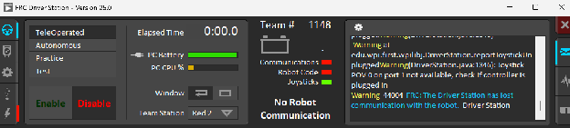

# How to Use Driver Station

Driver station is one of the most important programming tools because it allows you to enable and disable robot code and also has access to the SmartDashboard tool. **Driver station is used at all tournaments in order to enable robot code for a match.** It can be used to enable both autonomous and TeleOp code. In order to use it, a Wi-Fi or Ethernet connection is required.   
Booting up Driver Station with a robot connected, you will see a screen that looks like the following:  
The **Enable** and **Disable** buttons enable and disable the robots code respectively. You can also choose in what way to enable the robot’s code (ex. Selecting autonomous will run an autonomous path, selecting Teleop will enable the code as if controlled by a driver).  
On the center of the screen, you will see the status of the robot’s battery as well as white text that tells you of any issues that are arising with the robot’s connection to the computer.

This text can be:  
**No robot communication**: This means that there is no robot connected to the computer/the computer is unable to see the robot due to a radio or connection error  
**No Robot Code**: If the code breaks or crashes, this error may pop up as the robot is unable to run any code from the computer. Additionally, rebooting the robot code or uploading new robot code might cause this error to appear as the robot needs time to take in the new/rebooted code.

**If there are no errors, the text should read “(Mode selected) disabled/enabled.”** The mode selected depends on what state the robot is in (ex. If TeleOp is enabled, the text will read “TeleOp Disabled/Enabled”).  
Finally, on the right there is a log of the outputs the robot is printing to the Rio log.  
**IMPORTANT: When enabling robot code, always make sure that everyone around the robot keeps a safe distance as you don’t want any unfortunate accidents happening, especially around fast moving systems such as a drive or intake. Code lead is not responsible for death or injuries and will make fun of you.**

Finally, at the bottom you will see a small selection of options that correspond to the color of the robot (Red or Blue) and its starting position on the field (1 → Left, 2 → Middle, 3 → Right). 

**Clicking on the second tab in Driver Station will send you to a connection screen that looks like this:**

On the left, you will see a bunch of indicators corresponding to various means of connections to the robot (ex. WiFi, USB, E-net). If the indicator is on (green), that means that the robot is connected via that way (ex. WiFi indicator is green → Robot is connected to the computer by WiFi). If it is not on, then the robot is not connected in that way. You may also press the refresh button on the top of the screen in order to refresh the connection status.  
If needed, you may also reboot the roboRIO (effectively powercycling the robot) or restart the robot code (which rebuilds the robot code but does not do anything to the robot itself.

Clicking the third button will send you to a connection screen for **controllers**:

Here, all controllers connected to the robot are put together in a list depending on when they were connected. Clicking on any of these controllers in the list will bring up a small display to the right, showing the inputs the controller is receiving. **You may click the refresh button on the top of the screen to refresh the joystick connections** (useful if there is a controller connected but Driver Station doesn’t see it).
