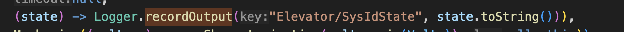

# Intro to Logging

IO Systems are different from regular subsystems in that they continually log their inputs and outputs for later review. Although WPILib already has a built-in ability to log inputs and outputs, we use **AdvantageKit**, which is able to log data efficiently and is also capable of being able to “playback” data to us, allowing us to see systems as they operated during a match in real time. Finally, AdvantageKit also allows us to connect to the robot and accurately see its current status.

Logging in code uses the static **Logger** class, which comes with AdvantageKit. Although most of our IO Systems implement the AutoLog notation (which automatically logs everything for us), it is still useful to know how to manually write to logs.

For manually logging a distinct output, you can use the recordOutput method as part of the Logger class, which takes in a key (unique or not) and a value to log. In AdvantageKit, the value is then recorded under that key for later use. Keys for logging work almost like a dictionary. Logging something under a key that hasn’t existed before will create a new logged field to view. Logging something under an existing key will simply change the value logged in that field.   
**Furthermore, you can create logging folders in the same way that you would create a file directory on your computer. For example logging a value under “Elevator/position” would create a new folder in the log file called “Elevator” where the value would be logged under “position.”**  

You can then see this in Advantage Scope by loading the log file.

Our logging code also has a built in “degraded” mode, which is activated when the logger is so overloaded with data that it is beginning to log things late, which is an issue because we always want up-to-date information. When the degraded mode activates, subsystems will progressively stop logging themselves, starting with the least important subsystem. When this happens you will be notified in the console.
