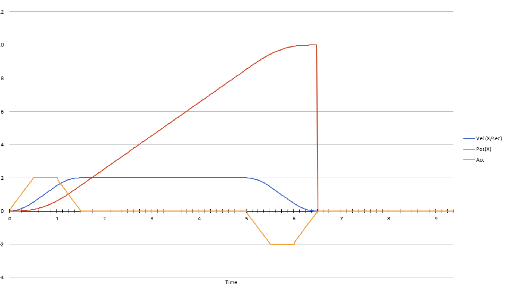
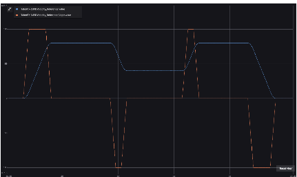
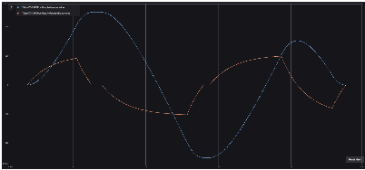
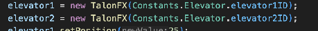
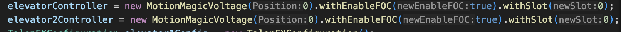
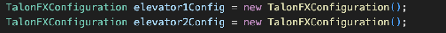
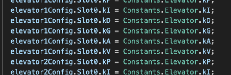
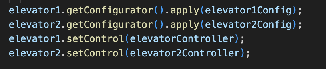

# IO Systems (OUTDATED)

> **OUTDATED.** Archived from the source guide. The table of contents marked this section outdated. The body below is the original text, kept for history.

Sections 8-11 will cover topics related to subsystem functionality and organization. **Our subsystems are all coded as IO Systems.** In order to code an effective subsystem, it is critical to be able to understand the structure of an IO System and how to recreate it.

## What are IO Systems and Getting Started with Them
In general, **an IO System is a special type of subsystem structure in which inputs such as velocity and position are logged and then used in order to get an output voltage (which translates to an updated velocity/position), which are then also logged.** This is usually done in order to get the inputs to a target value (such as a target velocity for an intake). *In other words, an IO System is essentially a PID controller that logs its inputs and outputs.*

In order to create an IO System for a subsystem, you must create 4 specific files (replace \[Subsystem\] with the real name of the subsystem:

\[Subsystem\]IO.java → A java interface which includes a method for the logging for inputs and outputs, a PID loop under which the subsystem will run periodically, as well as other methods that are needed for the subsystem to function. **This interface also contains the special subclass \[Subsystem\]IOInputs** which declares all variables that will be logged by \[Subsystem\]IOInputsAutoLogged.

\[Subsystem\]IOTalonFX.java → A file which implements \[Subsystem\]IO.java (as well as its methods) and has a constructor which largely creates the PID system responsible for the subsystem.

\[Subsystem\].java → A file which extends SubsystemBase and is the actual object that is created in RobotContainer’s constructor. It contains an instance of \[Subsystem\]IO, as well as an instance of \[Subsystem\]IOInputsAutoLogged. This file runs periodically and calls the methods of \[Subsystem\]IOTalonFx.java as well as updates the logged inputs of \[Subsystem\]IOInputsAutoLogged.

For general organization, the above three files should be placed in a separate folder for the subsystem in the “subsystem” folder like in the picture.

\[Subsystem\]IOInputsAutoLogged.java → This file extends the subclass \[Subsystem\]IOInputs and implements Loggable and Cloneable. This file runs periodically to log the inputs in \[Subsystem\]IOInputs automatically.

For organization, \[Subsystem\]IOInputsAutoLogged should be put in the “annotatedProcessor” file which is under the “generated” file in the code. If you can’t find this file, it may be because it's a hidden folder.

**The actual code in these subsystems will be explained later.**

## PID Systems
As stated in the introduction, an IO System is essentially a logged PID Controller. **A Proportional Integral Derivative (PID) Controller is a specific type of system which uses an input such as velocity in order to calculate the error (or difference) of the current input from its target. Then using specific constants (denoted as kP, kI, kD, etc.) the system does a lot of math in order to get a new voltage to apply to the system in order to make up for the error. The system then sends back the output to the system so that the process can repeat with new inputs and errors.** If done right, the system’s voltage should ramp up a lot at the start and then slow down as the system stabilizes around the target. 

*The Steps in PID:*  
A PID System always includes the P step, but does not necessarily have to use the I and D steps in the process if they are not needed. The steps are as follows:  
P → Standing for proportional, this is the simplest step of the process. The Proportional step takes the error of the system (defined as the difference of the current input from the target) and multiplies it by a constant kP, getting an output. This step is always necessary for the PID controller.

I → Standing for Integral, this process takes the integral of the sum of all the errors recorded so far in the controller and multiplies it by a constant kI. This step is added if the PID controller is always slightly below but never reaching the target. It helps bump up the output of the controller so that the target is reached. 

D → Standing for Derivative, this process takes the rate of change of error (so, how much the error has decreased/increased from the last time the process happened), takes its derivative and then multiplies that by a constant kD. This step is mostly done to avoid overshoot. If a system relies only on P, the controller may heavily oscillate back and forth as the system overshoots and then overshoots again to account for the previous overshoot. D, which can be both negative or positive, helps dampen the overshoot and steady it around the target. D should be added if the system is consistently having oscillations with only P.

The controller then adds together the outputs from the P, I, and D steps and that is the output that is sent to the system in voltage.

*PID Constants:*  
In general, a PID controller is able to take in 7 constants. In general, only kP is absolutely necessary for the controller to function and the other constants should be used if needed for optimization. The definitions of these constants are below.

These constants are directly used in the PID controller:

kP → The constant used in the P step of PID. In tuning, this constant should be added to or subtracted so that the system reaches the target super fast and has minimal oscillations.  
kI → The constant used in the I step of PID. In tuning, this should be a REALLY SMALL number, smaller than any of the other ones because it's only meant to be a small boost to the system’s output. If there is no I step, this constant should be 0\.  
kD → The constant used in the D step of PID. In tuning, increasing this constant will increase the damping effect by the D step, decreasing oscillations but at the cost of decreasing the output returned by P. If there is no D step needed, this constant should be 0\.

The other 4 constants are part of an optional **feedforward** system, which helps smooth out the outputs done by the PID and make everything a little smoother. This is completely optional but is generally recommended to smooth everything out. 

kS → Static friction compensation. When force is applied to a stationary object, that force must first overcome its friction to begin moving the object. This means that with a PID controller, the initial outputs may be lost due to the friction required to move the object. kS compensates for this by essentially adding a boost to help jumpstart the system and get it moving immediately.

kV → Voltage compensation. This constant helps determine the voltage needed to move at a constant velocity with no acceleration. 

kA → Acceleration compensation. This constant helps determine the voltage needed to accelerate at a certain rate. This is usually done to help a system reach a target velocity faster by applying extra force to boost acceleration. 

kG → Gravity compensation. This constant helps provide e xtra force to counteract the force of gravity on an object. In FRC, this is mostly used for subsystems which go up or down, such as elevators and arms. 

## MotionMagic and SysID
The math involved is quite complicated, which is why CTRE (the company that makes our motors) has provided a built-in PID System known as **MotionMagic**! This library takes in an input as well as all the constants you want it to use during the PID process (ex. kP, kI, and kD only). The system then uses those constants in a PID system, even adjusting them to optimize the system by itself!

*What is MotionMagic and How Does It Work?*  
MotionMagic is a library that is provided with CTRE motors that uses different types of motion profiles, as well as constants such as kP, kI, and kD, in order to act as a PID. It is also capable of slightly tuning itself according to the selected motion profiles in order to be more efficient. When configuring MotionMagic in any file, you are allowed to choose from three motion profiles. These are:

**Standard Motion Magic → Used mostly for positions.** Standard Motion Magic follows a trapezoidal motion profile where the velocity of the given motor/system ramps up steadily akin to a ramp before reaching a cruise velocity. At the same time, the motor moves to some position (usually measured in rotations). As the motor approaches the target position, the velocity ramps down. In effect, this creates a trapezoid shape if the velocity was graphed. This allows the motor to get to a position quickly while reducing oscillations (which in this case would be constantly moving back and forth between a position).  
This uses the standard PID constants (kP, kI, kD with optional feedforward constants). **kA must be set for this profile to work.**  
  
Credit: Motion Magic Documentation

**Motion Magic Velocity** → **Used mostly for velocity.** Motion Magic Velocity follows the same-style trapezoidal motion profile as standard Motion Magic. The difference is that Motion Magic Velocity never actually ramps down or ends unless you force it to end (such as setting a different target velocity or turning off the robot code). This motion profile ramps up the velocity according to an acceleration trapezoidal profile (described above in Standard Motion Magic), in which the acceleration increases, reaches a constant acceleration, then decreases as velocity reaches the target velocity.   
This uses the standard PID constants (kP, kI, kD with optional feedforward constants). **kA must be set for this profile to work.**  
  
Credit: Motion Magic Documentation

**Motion Magic Expo** → **Used mostly with velocity**. Motion Magic Expo follows an exponential motion profile rather than the standard trapezoidal profile. In this case, acceleration will ramp up and down constantly in order to get the velocity to a cruise velocity as quickly as possible. In other words, the acceleration is constantly corrected to ensure that the PID is acting as optimally as possible. This controller also has a cruise velocity parameter which allows the velocity to be capped at a certain speed. Otherwise, the controller will go to the maximum speed possible. **This should mostly be done to speed up a system to the maximum velocity and should not be used with target velocities**. **Both kV and kA must be set for this profile to work.**  
  
Credit: Motion Magic Documentation

**For more information on how each of these profiles work, please visit the [MotionMagic Documentation By CTR Electronics.](https://v6.docs.ctr-electronics.com/en/latest/docs/api-reference/device-specific/talonfx/motion-magic.html#motion-magic-velocity)**

*Setting Up Motion Magic In Code*  
Setting up any Motion Magic configurations requires a lot of code to make it run efficiently, but here is a very simple way to configure Motion Magic controllers.

All MotionMagic constructors take in one parameter depending on the type of MotionMagic you are creating. For example, regular MotionMagic (constructed as MotionMagicVoltage) takes in a position while MotionMagicVelocity takes in a velocity to go to. Additionally, **all MotionMagic controllers work off a slot system, which acts like a set of parameters for the system. These are set individually by you.** MotionMagic generally gives access to 3 slots (Slot0, Slot1, and Slot2) which all have access to PID constants (kP, kI, kD \+ feedforward constants). These can be specified when initially creating the controller but MotionMagic defaults to Slot0 if there is no explicit slot provided.

**All of the code below should be done in the \[Subsystem\]IOTalonFX, and specifically in its constructor method.**

In order to enable MotionMagic controlling, you must have 3 constructed objects → A motor (which MotionMagic will control), the MotionMagic profile to use, and a configurator (which will set up PID constants).

In order to construct a new motor object, simply declare a TalonFX motor object (we use TalonFX motors) and construct with the correct motor ID from the associated subsystem constants file (talked about later).  

Then, you want to construct the MotionMagic profile that you want the motor to use. **Important: In addition to the motion profile itself, MotionMagic has different output types for its controller. For example, MotionMagicVoltage will use voltage to apply the PID loop while MotionMagicTorqueCurrentFOC will use torque (how fast to turn the motor axle) to control the motor.**

Set the initial position in the constructor to 0, then add .withSlot(Slot you want to use) to apply the constants in the slot you want to use to the MotionMagic configuration. Finally, CTR Electronics has a subscription service that can be applied to specific motors that boosts their performance and allows for extra features. **When configuring a new motor, make sure this is applied. Add .withEnableFOC(true) in order to enable the perks of the subscription for that motor.**  

Finally, you want to construct the configurator that the MotionMagic controller will use. Since we use TalonFX motors, use the TalonFXConfigurator class and construct it without any parameters. All TalonFXConfigurator objects have public Slot variables that contain PID constants that can be changed. After constructing the TalonFXConfigurator, assign each constant in the slot you want to use to the corresponding constant in the subsystem’s constants file.  
  

After this, all you need to do is apply the controller and configurator to the motor in question. To do this, simply use the setControl (for the Motion Magic controller) and the getConfigurator().apply (for the PID configurator) methods.  
After this, you’re all set! Now, it’s up to you to find the PID constants and Motion Magic will do the rest of the work for you.
