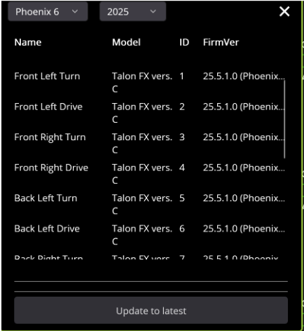

# Motor Status And Updating Firmware in Phoenix Tuner X

You may sometimes notice that when booting up Phoenix Tuner, some of the motor profiles will have a yellow or red outline instead of green. 

A green outline denotes that the motor is set up and ready to go. A red outline means that the motor is either broken or is about to disconnect from the robot (disappear in Phoenix Tuner). A yellow outline means that the motor needs a firmware update. 

**Firmware updates are important! Make sure to do them as soon as possible (as long as there are no other more important matters).** To update devices, click the checkboxes in the top right of each profile to select them, then select the up-arrow to pull up the update menu.

Then, simply click the “Update to Latest” button to begin the update. The program will tell you once everything is done.

For more information, the [Phoenix Tuner X documentation](https://v6.docs.ctr-electronics.com/en/stable/docs/tuner/index.html) is available.
