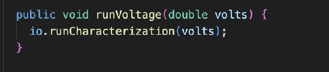
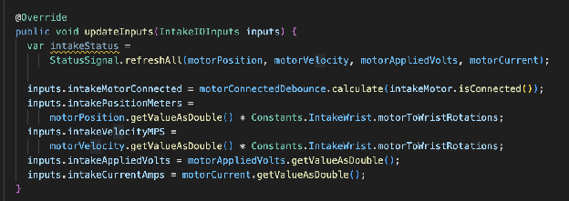
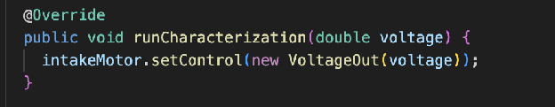
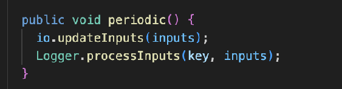

# Other Subsystems

## Standard Subsystem Methods
Although other subsystems apart from the drive function according to the IO System templates described previously, it is important that there are some key methods implemented in each IO system. Otherwise, each subsystem will have different methods. All methods, unless specified, should be abstractly defined in \[Subsystem\]IO.java and fully defined in \[Subsystem\]IOTalonFX.java. \[Subsystem\].java should also have each method defined in \[Subsystem\]IO.java, which should all call the same method in the IO.   
For example, here is the runVoltage method in AlgaeWrist.java, which calls the IO’s method (although it has a different name, it does the same thing).  

The most important method you should always implement is the updateInputs method. This method updates the logged data that is sent to the AdvantageKit logger. The method should take in the class containing all logged variables, and change all of its variables one by one to keep them up to date.   
Although this will vary subsystem by subsystem, all subsystems should always share two updates in this method. One is the motor status variable, which should be updated using the StatusSignal.refreshAll method, which takes in the position, velocity, voltage, and current of the motor connected to the subsystem. If there are multiple motors, all the motor statuses need to be updated one by one. Additionally, all motors should be checked if they are still connected using their motorconnectedDebounce value. To do this, you need to update the value using the calculate method, taking in the motors isConnected() boolean. Other than that, the updateInputs method should update everything else that is logged, converting it using defined conversions is necessary.

For example, the updateInputs method of the 2025 intake is shown below:  
IntakeIO.java abstract definition:

  
IntakeIOTalonFX.java full definition:

Additionally, each subsystem should also have a runCharacterization method, which takes in a voltage double and simply uses the setControl method on the subsystem motor(s). The setControl method takes in a VoltageOut object (basically just how much voltage will be sent to the motor), and so in the method call you should create a new VoltageOut object using the voltage double passed into the method.  
   

Finally, \[Subsystem\].java should also have a periodic method. This method SHOULD NOT be defined in \[Subsystem\]IO.java or the TalonFX file. It will be called periodically (unless changed manually, every 20 ms) and should simply call the updateInputs of the \[Subsystem\]IO object contained in the subsystem, as well as the Logger’s processInputs method which will log the inputs properly. Importantly, the processInputs method takes in a string key, which will act as the general category where the data will be logged, such as “Elevator” or “Intake.” The key should be the name of the subsystem. Based on the subsystem, the periodic method might have some other code and functionality, but it is important to remember that the simplest periodic method possible is often the best.  

## Sensors
This is also a good place to talk about sensors and limit switches. Some subsystems employ sensors, mostly for detecting whether it has intaked a game piece or not. Although in previous years we used sensors known as beam break sensors, in the 2025-2026 season we have instead replaced those beam break sensors with CAN ranges. Both sensors are described below, and are usually mounted onto intakes. Check with the mechanical team on whether any sensors are mounted onto the robot before coding your subsystems. Additionally, some position-based subsystems use a sensor known as a limit switch to stop themselves from accidentally exceeding the range they are supposed to go (such as rotating too much past a certain point).

## Beam Breaks:
Beam breaks work in a very simple manner. They consist of two sensors mounted directly across each other. The beam break sensor shoots out a signal in a straight line out and waits for a response back. If the signal hits the other side of the sensor, the sensor returns true (meaning the space between them is empty). If the signal does not hit the other side, the sensor returns false (meaning that something is in between the two sensors). In code, each beam break sensor has its own assigned ID that corresponds to the port it is located in on the Rio port. This should be set in a constants class. The beam breaks themselves are known as Digital Sensors in WPILib, so you can
