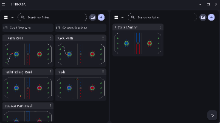
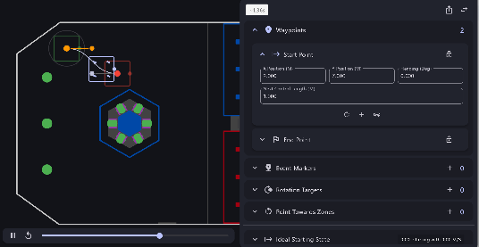
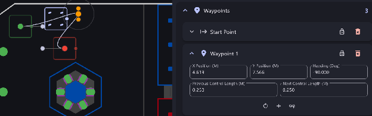
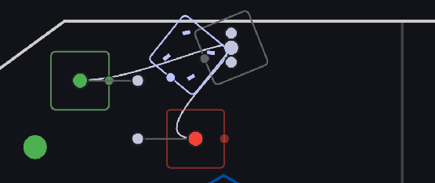
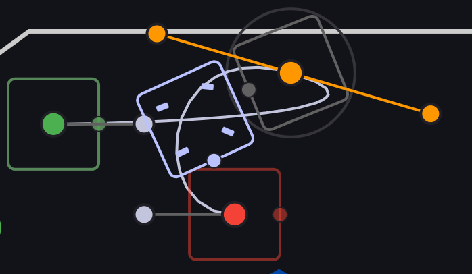
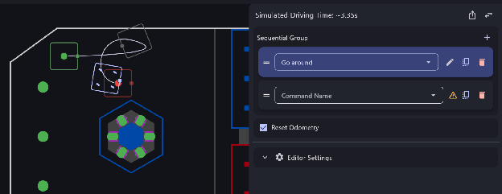
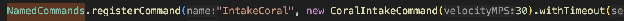
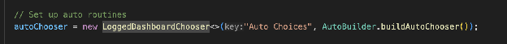

# PathPlanner and Autonomous

An important aspect of FRC games is the autonomous period, a 20 second period at the start of the match in which robots control themselves and do preprogrammed tasks around the field. Although we have our own autonomous maker that creates routines by itself based on the areas we want it to go, it is still good to know how to make autonomous routines manually in case something goes wrong and we need to fall back to manually tested routines. This is where PathPlanner comes in. It is a separate app from other tools such as Advantage Scope and WPILib which allows the user to create pre-programmed autonomous runs in an intuitive way. The app combines paths taken by the robot (which are drawn by the robot) and commands that the user wants the robot to do (registered with the PathPlanner library in WPILib).

PathPlanner works by allowing you to create autonomous runs which combine commands that you want your robot to do (ex. Intake for 10 seconds) with paths that you also outline in PathPlanner in which you program the robot to move from a set point A to a set point B. When you open the application, full autonomous runs will be available for you to edit and create on the left side, while the editing and creation of paths will be available on the right side.  

## Paths
In PathPlanner, paths are drawn by you to get the robot from a set point A to a set point B (other points may be added for longer paths). The robot starting position, signified with a green circle with a green box around it, is defined with a x,y position as well as a rotation position. This will be the way the robot will seek to start when you run the autonomous run. The robot ending position will also be defined with an x,y position and rotation, and it is signified with a red circle with a red box around it. Although the robot will automatically seek to go from the starting point to the ending point in as straight a line as possible, you may tweak the path in a few ways. While there are a lot more options to tweak paths, here are a few ways:  

1. **You are able to add points *in-between* the start and end points.** The robot will go to each of those points first before heading to the final point. This is useful when you need to explicitly outline a curve the robot needs to take, as curves are sometimes preferred to straight lines in order to make the path smoother. This is also useful for rotating the robot.

2. **You are able to add rotation targets at a waypoint**. By itself, a robot on an autonomous path will try to rotate to the rotation of the ending point gradually, which could be an issue if you need the robot to turn a certain way before it reaches the ending destination (such as with turning). PathPlanner gives the ability to place down rotation targets on waypoints in between the start and endpoints, and the robot will attempt to turn to them while running the path.

3. **You are able to modify the curve of a path**. This works in conjunction with adding points in between. PathPlanner gives the user the ability to adjust the curve of the path for smoother turning and moving.

It is important that you work to optimize the paths you create. You are able to see the time it will take to complete the path that you are editing. Make sure to get this as low as possible, as in a real match you only have 15 seconds to complete all the paths you want to do.  
When you have finished creating a path, you can put it into an autonomous routine! 

## Autonomous Routines
After creating some paths, you are now ready to create a full autonomous routine.   
  
Regular autonomous PathPlanner routines follow a sequential command structure: Robot follows a path, completes a command, follows a second path, completes a second command, and rinse and repeat until the autonomous run has finished. An autonomous routine in PathPlanner works as a queue list of paths and commands. You are able to add paths and commands as you wish. To add a path, you can simply import a path that you have already created. For commands, however, you will need to register them in code with PathPlanner’s library.

Commands in specific can be put into multiple groups of command systems:  
*Sequential Command Groups* → The most standard system. Each command runs after the previous command finishes.  
*Parallel Race Command Groups* → Two (or more)  commands are run at the exact same time. Once one command finishes, the other finishes as well.  
*Parallel Command Groups* → Two (or more) commands are run at the exact same time. Each command finishes at its own pace.  
*Parallel Deadline Command Groups* → Two (or more) commands are run at the exact same time. They end automatically if they are unable to finish by themselves within a set time.

Once you input all the commands and paths you want, your autonomous can be tested on the field!

## Registering Commands And Autonomous Routines
In order for a command to be able to be used in PathPlanner, it must first be registered in the PathPlanner library for that robot. Each robot has its own PathPlanner library with its own registered commands. In order to register a command with PathPlanner, you need to use the registerCommand method found in the NamedCommands class under the PathPlanner library. The method takes in a command to run (which can follow the exact same structure as described in Sections 12 and 13\) and a name to call that command in PathPlanner. It is recommended that you create separate autonomous commands and teleop commands in code to avoid unwanted errors and bugs. After a command is registered, you should be able to select in PathPlanner in any autonomous routine you want. Commands can also be registered with a timeout.  

PathPlanner autonomous routines themselves need to be registered in robot code in order to be usable on the robot. To do this, PathPlanner automatically gives access to a class called AutoBuilder, which allows you to create an autonomous chooser from which you can select autos in the dashboard. To do this, you simply need to initialize the chooser using AutoBuilder.buildAutoChooser, which can be passed into the initialization of a dashboard chooser (which is then put onto Shuffleboard). buildAutoChooser automatically populates the chooser with all the autos on your robot in PathPlanner. 

For more information, here is the [PathPlanner documentation](https://pathplanner.dev/home.html)
