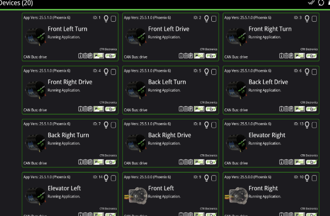
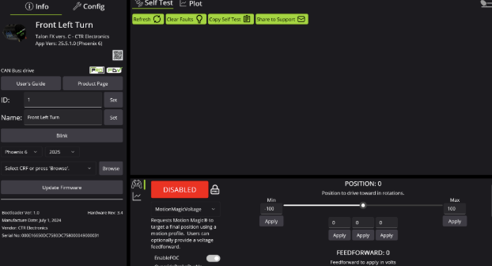

# Phoenix Tuner Basics

When Phoenix Tuner is booted with a connected robot, the screen will look something like this:

If the screen does not list any motors, make sure you are connected to the robot. If you are, make sure that you are using the Driver Station connection (click on the menu option in the top left and look at the “Connection” option).

**Always make sure that you see all the motors, CANs, and the Pigeon currently on the robot on the screen.** If a motor is not seen on the screen, that means it is not being processed through the robot and should be troubleshooted.

Each motor profile shows its name, current firmware status and its assigned ID. To look at a specific motor in question, click on a motor profile to get to its profile screen:

This screen shows its ID, name, and other characteristics of the motor. To set the name and IDs, use the text boxes on the left that correspond to each and then press the set button in order to save the change. 

**IMPORTANT: Duplicate IDs are NOT ALLOWED under any circumstances. When setting up the robot, always ensure there are no duplicate IDs.**