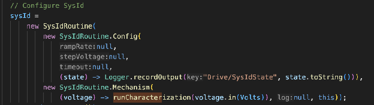
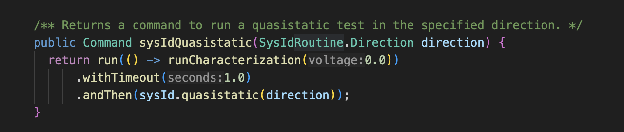
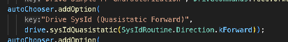

# SysID

## What is SysID?
Finding constants for Motion Magic can be a daunting process, as the ideal constant is often a small seemingly random number. Lucky for us, WPILib has a convenient way to find those ideal constants through a process called **System Identification (SysID).**  
**SysID is the process of putting robot subsystems through stress tests in order to mathematically figure out ideal PID constants.** 

WPILib does SysID by running two types of tests:   
Quasistatic → The voltage and system is ramped up gradually so that there is very acceleration so that the overall behavior of the system is measured  
Dynamic → The voltage and system is ramped up in dynamic “steps” to measure how the system works during acceleration.  
It then logs everything into a specified logger under a “state” variable (which has a toString).

## Setting up SysID In Code
All SysID set up should occur in the \[Subsystem\].java file which was described in the first part of this section. Before starting, you should have set up a way to log outputs for the subsystem (described in part I of this section and Section 9). 

The SysID routine as used in MotionMagic is actually an object of the class SysIdRoutine, which will automatically import into your file as soon as you declare a variable with the SysIdRoutine class type. The sysId variable should then be initialized in the subsystem constructor.   
  
Note: You might want to make this variable final.

The SysIdRoutine constructor takes in a Config (SysIdConfig) object and a Mechanism (SysIdMechanism) object as parameters. There’s no need to make these separate variables, you can simply call their constructors in the SysIdRoutine constructor itself.

***In the Config constructor:***  
You will need to provide a voltage ramp rate (for quasistatic tests) and a dynamic step voltage (for dynamic tests), a timeout after which the test automatically stops, and a lambda into which you will pass in a way to log the data recorded.  
**For the first three, put null in order for the constructor to go to default values for each of these. For the lambda logging parameter, pass in Logger.recordOutput** **under a “SysIDState” tab to distinguish these results from non-SysID results when looking for them in the data. In recordOutput make sure to pass in the toString of the “state” variable recorded in order to actually record the data.**

***In the Mechanism constructor:***  
You will need to provide a voltage consumer (where the voltage will be going to), a log consumer (what is being logged by the SysID, and the subsystem being tested.  
**For this, use another lambda function to pass in voltage into Subsystem’s base runCharacterization command (which does all of this for you). Set the log of the command to null and the subsystem to the subsystem in which the SysID is being set up.**

**In the end, you want something like this:**  

## Running and Using SysID
Since SysID is essentially a stress test for the robot, the best way to run SysID is by using autonomous commands and running each test as an auton on the robot separately. Each subsystem should therefore have 2 methods that each return a Command that runs a SysID routine on the robot. Each method uses an enum parameter which determines whether the routine returned goes forwards or backwards.   
Each method uses a lambda function to return a command which first sets all subsystems motors to zero voltage through the subsystem’s runCharacterization method, and then runs the sysID routine configured previously with the enum corresponding to a forwards or backwards routine.  
  
Note: SysIdRoutine.Direction is a built-in library which has enums corresponding to forwards and backwards

In RobotContainer, these commands should then be registered under the autoChooser dashboard (which allows us to select these routines before starting the robot).  
  
To run each routine, set the robot into autonomous mode in Driver Station, select the routine you want to run, then start the robot.  
**NOTE: For each routine, ensure the robot has a large space that it can drive around in or else it might crash into something. A full SysID run should run each routine one after the other without turning the robot off completely (so that all SysID routine results are logged together).**

## Analyzing SysID Results
WPILib comes prepackaged with SysID tools which analyze the results of your SysID routines. In order to start it, go to VS Code and click on the WPILib icon in the top right. Search up the Start Tool, select it, and then select SysID from the dropdown menu.

You will be greeted with a screen like this (see first image):  
Credit: FRC SysID Documentation

You will want to locate where your robot outputs are logged, and then open that data file. Afterwards, the Data Selector will ask for specific variables and you will want to take your SysID results and drop them into corresponding slots (see second image). Once everything is slotted in, the analyzer will ask you for the type of SysID analysis you want to run, and after selecting that you can press the Load button that appears at the bottom. After some analyzing, you will get your results!

The results given show you the optimal calculated PID and feedforward constants for your subsystem. Simply copy them into your code and you’re all set!

You can now do this for every subsystem to get optimal PID values!

Credit: FRC SysID documentation.

For more information, the [FRC SysID documentation](https://docs.wpilib.org/en/stable/docs/software/advanced-controls/system-identification/index.html) goes into this process more deeply.
