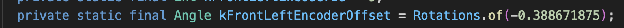

# The Drive Subsystem

Unlike other subsystems which generally follow a set structure, the drive subsystem has some special code and capabilities. Although it mostly mimics IO systems, the drive actually puts together four separate IO systems and it is absolutely crucial that the code for the drive system is functioning properly with the correct constants.

## The Basics Of Drive
The drive subsystem is unique in that it is an IO system made up of 4 IO systems. The drive system is made up of 4 “modules,” which are the four wheels of the robot (top left, top right, bottom left, bottom right). Each module contains a steer and a drive motor. Each module is an IO system that takes in steering PID constants and driving PID constants. This will be important later when PIDs come into play. Additionally, each module comes equipped with a gyro, which uses encoders in order to report to the motors what direction the wheels are facing. Finally, the drive subsystem uses limelights in order to estimate the robot’s position on the field through math involving standard deviations. 

When the robot driver moves the left joystick, it returns a value \-1 through 1 that corresponds to forward or backward movement and how powerful that movement should be. The position of the joystick itself (ex. Pointing left, right, up, etc.) is also returned, allowing the robot to move freely. Likewise, the right joystick allows the robot to turn using the same logic. ***When testing the drive, be careful because the joysticks are highly sensitive, especially when PIDs are untuned. Please make sure not to bump into any walls.***

**IMPORTANT NOTE ON BURNOUTS: Burnouts occur when you rapidly move the robot over carpets such as that found in the robotics room and downstairs. Rapid movement can be making the robot turn fast in either direction, having it turn back and forth, moving it fast then stopping it suddenly without allowing for deceleration, or a combination of those. This leaves extremely noticeable marks on the carpet. DO NOT DO BURNOUTS UNDER ANY CIRCUMSTANCES.**

Because most of the drive code is prewritten and standardized, you really don’t need to worry about changing it unless you are adding something to the drive system or changing how it works *(Please do this only if you know what you’re doing)*. However, issues with drive may come up due to improper zeros, PID constants, or mechanical issues.  
***In terms of code, the drive can malfunction in a limited number of ways:***

1. **Motors point in the wrong direction → Incorrect zeros**  
   1. **NOTE: IF THIS HAPPENS REPEATEDLY DESPITE YOU FIXING THIS, THIS MAY BE A MECHANICAL ISSUE WITH THE ENCODERS**  
2. **Oscillations in the drive → Untuned PID values**  
   1. **This may lead to burnouts**  
3. **Incorrect pose estimates → Limelight images are suboptimal**  
   1. **NOTE: THIS MAY ALSO BE A MECHANICAL ISSUE WITH THE LIMELIGHTS OR GYROS**

**If the error encountered is one of the above, refer to the next section or the vision section in the case of incorrect pose estimates. If these issues persist despite fixes being implemented, or if another issue comes up, make sure to double check with the mechanical team to ensure this isn’t a mechanical issue.** 

 

## Angle Offsets and PIDs
Because the drive system is an IO system at its core, it takes in PID constants as well as special constants regarding angle offsets to calibrate module gyros. It is important that all of these constants are correct and well-tuned to prevent malfunction.

*Zeroing Angle Offsets*  
As written above, module motors receive data from encoders to figure out which way the wheel they are in charge of is facing. This is how motors know, for example, which way forward is. In order to do this, each encoder has a “zero,” which is a reference value and is supposed to be the position at which a wheel faces forward. However, because all encoders are different, encoder zeroes vary, which means that without tuning going forward will cause the robot’s wheels to go in random directions. **The gyro zeroes need to be tuned using offsets so that when the driver goes forward all motors spin in the correct direction.**  
In the drive constants, each module has a corresponding encoder offset constant, which you will need to tune upon getting a new robot. This represents how far off the module will turn from the zero value upon going forward.  

When setting the constant, set the value in rotations as set above. For reference, 0.5 is half a rotation (180 degrees), 0.25 is a quarter of a ration (90 degrees).

***To zero a robot, you will need to know which way forward is on the robot and have a long flat object such as a piece of wood. Tilt the robot on its side so you can see and rotate the wheels manually. Then, follow these steps.***

1. **Set modules to their original zeroes**  
   1. **Turn on the robot, and then go forward. Memorize which way each wheel is going and how you will need to turn it from that position to make it face forward.**  
2. **Rotate modules to face forward**  
   1. **Turn off the robot, then turn each wheel so that it faces forward. Use the long object you have to make sure that all the wheels are in line with each other.**  
3. **Record angle offsets**  
   1. **Go to each CAN Bus on Phoenix Tuner X one by one, and have them each display their absolute positions. Take those positions and set the angle offsets to them.**   
4. **Test and if correct if needed**  
   1. **Turn on the robot and go forward again, making sure to test turning the wheels slightly as well using the left joystick. If you zeroed correctly, the wheels should all point in the same direction and go forward. They should also turn in unison. In that case, you’re done!**  
   2. **If the wheels once again face incorrect directions, you will need to rezero entirely. Sometimes, it may be that the wheels face correct directions, but some of them go backwards! In that case, add or subtract 0.5 from their angle offsets to flip them around.**

If you need to rezero multiple times and it seems that the offsets change wildly every time you do so, it could be that the encoders themselves are broken and need to be replaced. 

*Drive and PIDs*  
Although each module is an IO system and functions by the same logic as other subsystems, drive modules are different in that they have two different motors, the drive and the steer. Because of this, the drive subsystem actually has two different sets of PID constants: the drive constants, which are the same as regular PID constants and are used when the robot moves, and a steer P constant (the others aren’t necessary), used when the robot turns in place. Oscillations in the drive can either be the result of untuned drive PIDs or untuned steer PIDs depending on when they happen. 

Although tuning is effectively the same, it is important to note that when doing SysID on drive, two of the tests correspond to going forward and backward (drive PID) and the other two correspond to spinning the wheels (steer PID). **Although you still need to run all tests at once, keep in mind that you will need to run two analyses using them. One should be for the drive PID, analyzing linear velocity. The other should be for the steer PID, analyzing angular velocity and position.**
