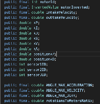
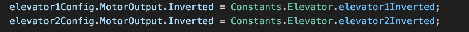

# Tuning PIDs

## Tuning PIDs
In order to optimize a PID System, it is necessary to tune its values so it reaches peak efficiency. 

When first applying the PID, you should start only with the P step, increasing it gradually so that the system reaches a point where it gets to its target output quickly with minimal oscillations.  
Once this point is reached, you should add in the D step, increasing it gradually until noticeable oscillations are gone. *It is important that the addition of D does not significantly decrease the speed of the system, only enough to get rid of oscillations.*  
If the P and D steps are unable to hit the target by themselves, add in a little bit of I.

After your initial tuning, further tuning the PID should continue in the following steps:

1. **Increase kP**  
   1. Begin by increasing P, increasing the speed of the PID controller. Stop increasing kP once you feel that the new PID speed is fast enough and there are noticeable oscillations during the process.  
2. **Increase kD**  
   1. Increase kD until the noticeable oscillations go away. Make sure to listen closely to the system itself as some oscillations may be audible, but not seeable.  
3. **Repeat until satisfied**  
   1. Repeat steps 1 and 2 until you are satisfied with the PID speed.

Once properly tuned, a PID should hopefully not need to be tuned again. However, if you feel the need to optimize the PID further, please do so.

## Constants Classes
Let’s say you finally figured out the perfect PID constant for a subsystem. You’ll want that saved somewhere so that you can always access it. Furthermore, if you want to optimize it further, it would be ideal to have a single point of reference which you can modify rather than having to go through every file and change a corresponding variable. This is where Constants classes come in!

**A Constants class is a separate file in our robot code which holds all the constants to specific subsystems and classes. In this class, ALL variables should be *public* and *static*.** Additionally, you may make most of the variables *final* as long as you make sure that it will never be changed. **PID constants should NOT be made *final* because MotionMagic tweaks them during its runtime.**  
Here, for example, is an excerpt from the Constants class used in the 2024-2025 season.   
(These are not static variables because we used a different constants organization, but in the new organization system all these variables would be static and named descriptively).  
  
In general, when making constant classes or making new constants in general it’s best to follow the structure either already present in the code. As of now, the organization system is a constants class in each subsystem folder for that subsystem.

From here, anytime you want to change a constant in a constants class, go to the constants class and change it there. For calling the constants in code, refer to the constants class statically and call variables from it.  

