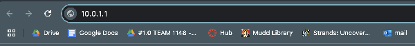
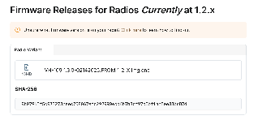
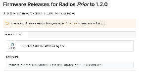
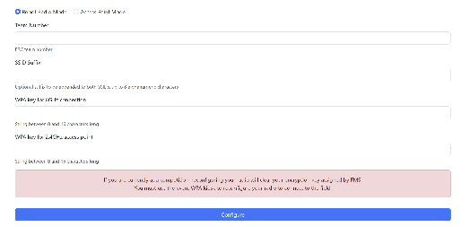

# Radios and How to Update Them

The radio is one of the most important components on the robot because it allows the robot to connect wirelessly to computer code without needing an ethernet connection. **All of our robots use Vivid Hosting Radios**.  
Once a radio is installed on a robot, it must first be configured and then continually updated throughout the season in order to be up-to-date. 

## Radio 101: On The Robot
In order for a radio to work, it must first be connected to the robot (which also acts as a power source) or some sort of power source if used without a robot.  
**In order to connect to a computer from a robot, the radio must be connected to the Rio by an ethernet cable in the “Rio” Port.** **If you are using ethernet to connect the computer to the robot, you must plug the computer tether into the “DS” Port on the radio.**

## Radio 101: Without a Robot
If you wish to use a radio without a working robot, you will need access to a special wall adapter that is capable of ethernet connection (these are known as PoE Wall Adapters and we have some in the lab). Connect the wall adapter to the wall, then use an ethernet cable to connect the “RIO” and the “PoE” ports on the radio and adapter respectively. Since you cannot wirelessly connect to the radio without a robot, use an ethernet cable plugged into the “DS” port on the radio and a port on the computer.

## Accessing Radio Settings
All radios transmit their connection through WiFi using a static IP as an address. For most teams, the IP address they use is standardized to the team number. For example, **all of 1148’s configured radios are set to broadcast on the IP 10.11.48.1. The standard IP address for a *new radio* is 10.0.1.1.**  
In order to access the settings for any radio, you must input the IP address it is broadcasting at into a search bar, like this (default frequency used):   

## Configuring A New Radio
When you access a radio’s IP address in a browser (10.0.1.1), you are greeted with a page that looks like this:

Most of the fields in the settings will be blank and must be filled in before the radio can be used at any tournament. **In the team number, put the number of our team (1148).** The SSID Prefix is optional, but can be used in the case of A and B robots (ex. Putting “A” in the SSID Prefix of the A robot and a “B” for the B robot).   
**For the both WPA suffixes, the suffix is “11481148”**  
If the browser errors while trying to load the page, that means the radio is either not on, not broadcasting, or rebooting itself. **In this case, check the radio**.

**Once everything is ready, press configure and wait for the confirmation message.** After that, you should be done!  
***Important: At a tournament, go to the official Radio Kiosk to set up and flash radios.***

## Updating (“Flashing”) Radios
A radio must be constantly updated (may also be called “flashed”) to up-to-date releases. Vivid Hosting usually releases two different versions of updates: One for devices one version back (ex. 1.2 version radios for a 1.3 release) and one for further outdated devices (ex. Radios with 1.1 version for a 1.3 release).   
  
**In order to update a radio, your computer must be connected to it either by ethernet or WiFi.** Here is a step-by-step guide:

1. **Download the right release version for the update**

In order to view the update version of a radio, input the IP address the radio is broadcasting at and add “/status” to the end of it, like this:  
  
This should bring up a small page that lists the configurations and version of a radio. After confirming the version, download the right update version here (save the SHA-256 letter sequence because you’re going to need it):

[Vivid Hosting Firmware Releases](https://frc-radio.vivid-hosting.net/overview/firmware-releases)

2. **Head to the radio settings**

Accessing settings and configuring radios is described in subsections 1 and 2\.

3. **Upload the downloaded update to the radio and** 

Head down to the “Firmware Upload” section of the radio settings and upload the file containing the update to the radio. In the checksum, copy and paste the “SHA-256” letter sequence found under the release in the firmware releases.

4. **Click the upload button and wait**

Once the upload button is clicked, you will need to wait a while while the radio installs the update and reboots. You will know the radio is fully ready when the “SYS” light on the radio is blinking slowly (around once per second).

Further radio documentation can be found here:  
[Vivid Hosting Radio Documentation](https://frc-radio.vivid-hosting.net/)
